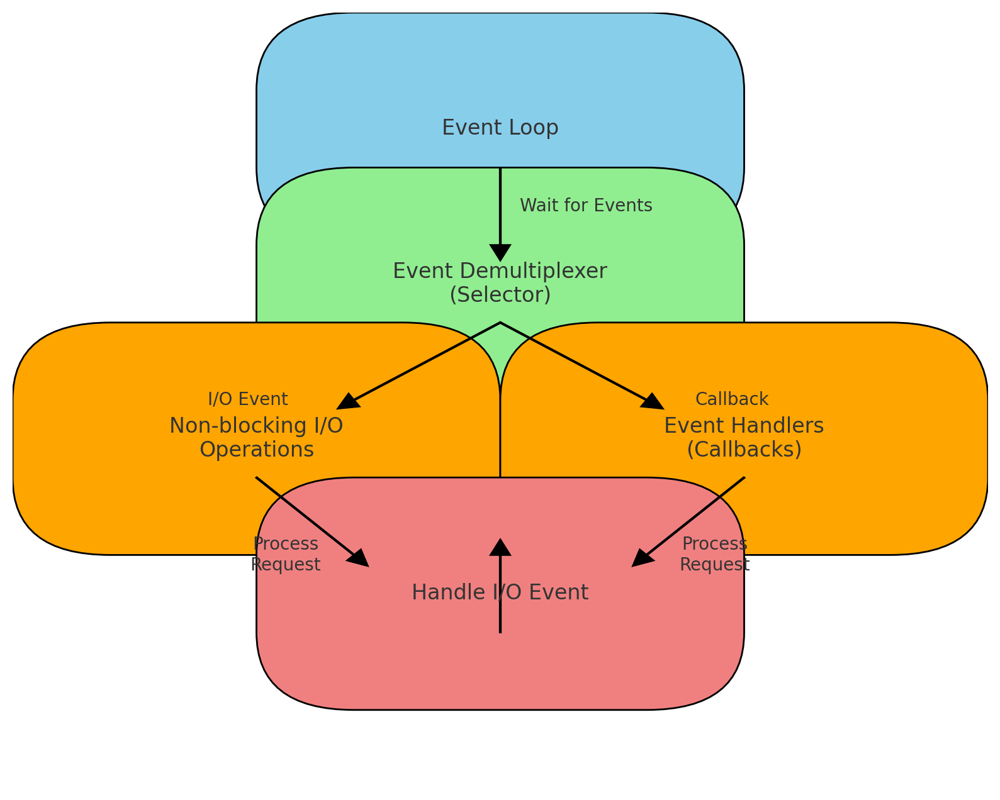

---
date:
  created: 2024-12-24
categories:
  - Java
tags:
  - Java
authors:
  - charlie
readtime: 8

---
# Reactor And Servlet Async Response
本文从Servlet Async Response对比Reactor进行总结
## 异步请求处理流程
### 请求开始：
    请求到达服务器，通常是通过同步方式处理的。
    如果你决定将请求转换为异步处理，调用 request.startAsync(request, response);。这时，AsyncContext 对象被创建并返回。
### 释放Servlet线程：
    调用 startAsync 之后，Servlet容器会将当前的Servlet线程释放，使其可以处理其他请求。
    此时，请求尚未完成，但线程已经被释放，这使得服务器能够更高效地处理更多的并发请求。
### 异步任务执行：
    你可以通过 asyncContext.start(Runnable) 提交一个异步任务，或者使用其他方式在后台线程中处理请求。
    在异步处理过程中，响应输出不会立即关闭。
### 异步处理完成：
    当异步任务完成后，你需要调用 asyncContext.complete() 来表示请求处理的结束。
    在调用 complete() 后，Servlet容器会再次获取一个线程来发送响应并完成请求。
### 连接管理：
    连接在异步处理过程中不会被立即关闭，而是保持打开状态，以便在异步任务完成后继续使用。
    连接的关闭是由容器在异步处理完成后自动管理的，当 asyncContext.complete() 被调用时，响应被发送，连接会被关闭。
### 超时管理：
    异步请求有超时时间（默认30秒），可以通过 asyncContext.setTimeout(long timeout) 设置。
    如果超时未处理完成，请求会被自动终止，容器会调用超时回调方法 asyncContext.onTimeout()，并且连接也会被关闭。
### 连接释放
    在 startAsync 之后，连接会一直保持，直到异步处理结束（调用 complete()）。
    如果请求超时，连接也会被释放。
### 总结
    startAsync 不会立即释放连接，但会释放处理请求的线程。连接的关闭是在异步处理完成后由容器管理的。异步处理使得服务器在等待较长的任务时能够更好地利用资源。
    Servlet容器在处理异步请求时，会在异步处理完成后再次获取一个线程来发送响应并完成请求。这个过程并不是基于 Reactor 模型，而是基于传统的 线程池模型 和 事件驱动模型。
## 传统的 Servlet 模型
    在传统的 Servlet 模型中，每个请求都由一个线程处理，直到请求处理完成。然而，在异步请求模型中，Servlet 容器释放了处理请求的线程，让它去处理其他请求，而不必等待异步任务完成。这提高了服务器的并发处理能力。
## 异步请求的处理模型
### 线程池模型：
    当请求被标记为异步时，Servlet 容器将请求放入一个等待队列，并将处理该请求的线程释放回线程池。
    处理异步任务的线程（通常来自不同的线程池）会执行相应的任务（如调用第三方服务、数据库查询等）。
    当异步任务完成时，Servlet 容器从线程池中分配一个新的线程，来处理完成后的响应任务，并将响应发送回客户端。
### 事件驱动模型：
    Servlet 规范（例如Tomcat等容器）使用了一种事件驱动的机制来处理这些异步事件。
    当异步任务完成时，事件触发了一个监听器或回调函数，Servlet 容器会将这个事件转交给一个线程去处理。
    这也是一种非阻塞的 I/O 模型，有些容器在内部可能使用类似于 Reactor 的机制来处理 I/O 操作（例如 NIO），但异步 Servlet 的编程模型本身仍然依赖于传统的线程池模型。

## Reactor 模型
    Reactor 模型通常用于完全非阻塞的、事件驱动的服务器架构，比如在 Netty 或者 Spring WebFlux 中。它基于单线程或少量线程处理大量并发连接，通过事件循环机制触发处理逻辑。Servlet 容器中的异步处理虽然借鉴了一些异步和非阻塞的思想，但并没有完全采用 Reactor 模型，而是更多地依赖于线程池来处理任务。
### Reactor 模型图

### 这是Reactor模型的流程图，展示了事件循环如何处理非阻塞I/O操作：
#### 事件循环（Event Loop）：
    事件循环不断运行，等待和处理事件。
#### 事件多路分发器（Selector）：
    事件循环通过Selector（事件多路分发器）等待I/O事件（例如网络连接、文件读写）。
#### 非阻塞I/O操作：
    当有I/O事件发生时，Selector会通知事件循环。
    这些I/O操作是非阻塞的，不会阻塞事件循环的继续运行。
#### 事件处理程序（Callbacks）：
    一旦事件循环检测到I/O事件，事件处理程序（通常是回调函数）会被触发。
    这些回调函数负责处理实际的I/O事件。
#### 处理I/O事件：
    回调函数执行时处理具体的I/O操作，并可能发起新的异步操作或产生新的事件。
#### 总结    
    整个流程不依赖于传统的线程池，而是基于事件驱动的模型，通过单个或少量线程高效处理大量并发I/O操作。这就是Reactor模型的核心理念