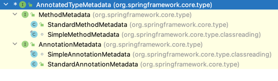

# Spring AnnotatedTypeMetadata
> Defines access to the annotations of a specific type (class or method), in a form that does not necessarily require class loading of the types being inspected.  Note, however, that classes for encountered annotations will be loaded.


## subclass hierarchy 

1. MethodMetadata is responsible to gain annotations metadata from method that annotated this annotation
2. AnnotationMetadata is responsible to gain annotations metadata from class that annotated this annotation

## AnnotationMetadata example 
- AppConfig
```java
@Configuration
@Conditional(MyCond.class)
public class AppConfig {
}

```
- MyCond, metadata class is org.springframework.core.type.classreading.SimpleAnnotationMetadata

```java
public class MyCond implements Condition {


    @Override
    public boolean matches(ConditionContext context, AnnotatedTypeMetadata metadata) {
        if (metadata instanceof AnnotationMetadata) {
            System.out.println("MyCond matches AnnotationMetadata");
        }
        System.out.println(metadata.getClass());

        boolean isAnnotatedConfiguration = metadata.isAnnotated(Configuration.class.getName());
        System.out.println("MyCond matches " + isAnnotatedConfiguration);
        return true;
    }
}
```
## MethodMetadata example
- AppConfig
```java
@Configuration
@Conditional(MyCond.class)
public class AppConfig {
    @Bean
    @Conditional(MyMethodCon.class)
    public Bar bar() {
        return new Bar();
    }
}

```
- MyCond, metadata class is org.springframework.core.type.classreading.SimpleMethodMetadata

```java
public class MyMethodCon implements Condition {
    @Override
    public boolean matches(ConditionContext context, AnnotatedTypeMetadata metadata) {
        System.out.println(metadata.getClass());
        return true;
    }
}
```